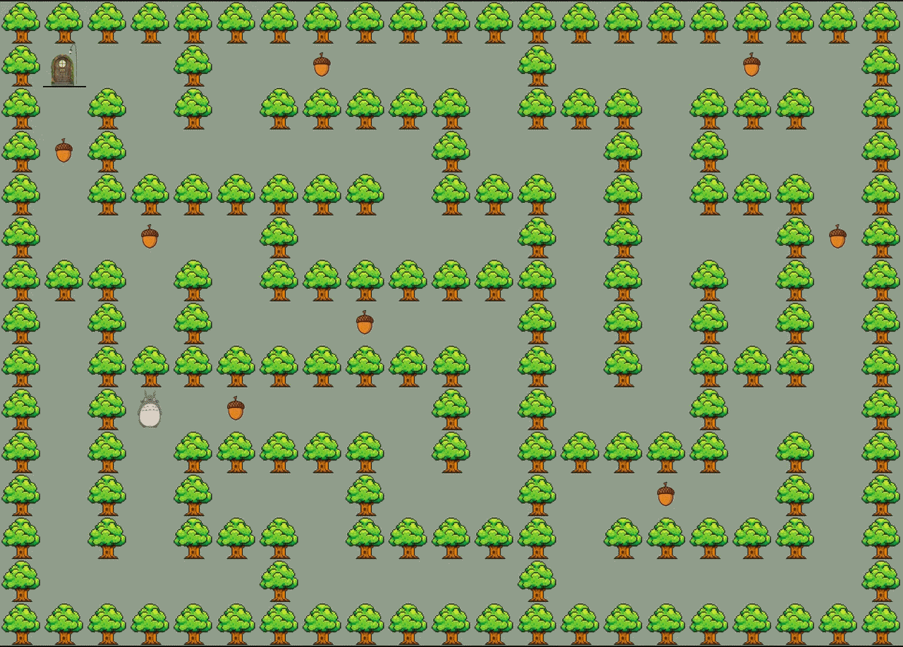

# so_long

so_long is a simple 2D game developed as part of the 42 curriculum.  
The goal of the project is to build a small game using the MiniLibX graphics library, where the player collects items and reaches the exit.

---

## Gameplay

<p align="center">
  
</p>

---

## Game Objective

The player must collect all collectibles on the map and then reach the exit while navigating through walls and paths.

---

## Features

- 2D tile-based rendering
- Player movement system
- Collectible items
- Exit that activates after collecting all items
- Map validation
- Wall collision detection
- Move counter display

---

## Controls

| Key | Action |
|-----|------|
| W | Move up |
| A | Move left |
| S | Move down |
| D | Move right |
| ESC | Exit game |

---

## Installation

Clone the repository:

```bash
git clone https://github.com/username/so_long.git
cd so_long
```

Compile the project:

```bash
make
```

Run the game:

```bash
./so_long maps/map.ber
```

---

## Map Format

The game uses `.ber` files to define the map.

Example:

```
1111111
1P0C0E1
1000001
1C00001
1111111
```

### Map Symbols

| Symbol | Meaning |
|------|------|
| 1 | Wall |
| 0 | Empty space |
| P | Player starting position |
| C | Collectible |
| E | Exit |

---

## Map Rules

- The map must be rectangular
- The map must be surrounded by walls
- There must be:
  - **1 player**
  - **at least 1 collectible**
  - **1 exit**
- The player must be able to reach all collectibles and the exit

---

## Technologies

- C
- MiniLibX
- Event handling
- File parsing
